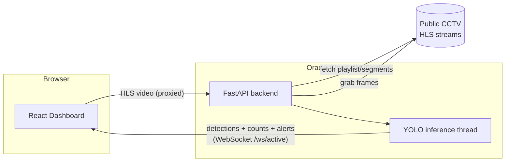

# Malioboro Monitor (Demo)

**Real-time pedestrian & traffic density monitoring for Malioboro, Yogyakarta — computer vision on live public CCTV streams.**

This is a simplified, portfolio-focused deployment of an undergraduate thesis (skripsi) project. The original thesis system includes authentication, a persistent database with historical trend charts, and background polling across all 22 cameras simultaneously. This demo strips that down to a **stateless, unauthenticated, single-active-camera** app so it can run comfortably on a free-tier VM and be shared publicly without exposing credentials or requiring a database.

---

## Live Demo

🔗 _[add deployed URL here]_

---

## Tech Stack

| Component  | Stack |
|------------|-------|
| Backend    | FastAPI (async) + OpenCV + YOLO (Ultralytics) |
| Frontend   | React 18 + Vite + Tailwind CSS + Recharts |
| Detection  | YOLOv8n, fine-tuned on 9 local classes (see [Model benchmark](#model-benchmark)) |
| Deployment | Docker on an Oracle Cloud Always Free VM (Ampere A1, arm64, CPU-only) + Vercel/Cloudflare Pages for the frontend |
| CI/CD      | GitHub Actions (backend) + native git integration (frontend) |

Detection classes (model outputs these Indonesian names directly): `orang` (people), `sepeda` (bicycle), `motor` (motorcycle), `bajaj`, `becak`, `andong`, `mobil` (car), `bus`, `truk` (truck).

---

## Architecture



- The browser fetches HLS video through the backend's `/proxy/hls/{camera_id}` route (avoids CORS issues with the CCTV origin) and displays it via an `` MJPEG tag with a `<canvas>` bbox overlay drawn from WebSocket detection messages.
- Only the **currently viewed camera** runs inference — switching cameras stops the old stream and starts the new one. There's no background polling of the other 21 cameras (removed in this demo to keep load predictable on a 2-core VM).
- The backend is **fully stateless**: no database, no disk-persisted images. Alerts (crowd/traffic threshold breaches, 5-minute cooldown per camera+type) and the 15-minute rolling trend chart are computed in-memory / client-side from live WebSocket messages and reset on reload or restart.
- No authentication — this is a public read-only demo. CORS is restricted to the deployed frontend origin, and the camera-switch endpoint + WebSocket connections are rate-limited per IP to protect the free-tier VM from abuse.

---

## Model benchmark

Candidates were benchmarked with `backend/scripts/benchmark_model.py` — pure inference time (no network/decode) on a real frame grabbed live from camera 1, at `imgsz=960`, averaged over 15 runs:

| Model | avg ms/frame | FPS | Detections (test frame) | Avg confidence |
|-------|-------------:|----:|-------------------------:|----------------:|
| **yolov8n (chosen)** | **14.4** | **69.2** | 12 | 0.65 |
| yolo11n | 18.1 | 55.1 | 16 | 0.63 |
| yolo11s | 25.7 | 38.9 | 27 | 0.58 |
| yolov8s | 26.7 | 37.4 | 17 | 0.64 |
| yolov8m | 51.8 | 19.3 | 12 | 0.74 |
| yolo11m | 53.4 | 18.7 | 25 | 0.60 |
| yolo11l | 66.8 | 15.0 | 33 | 0.72 |
| yolo11l (fine-tuned) | 65.7 | 15.2 | 15 | 0.82 |
| yolov8l | 88.6 | 11.3 | 9 | 0.64 |

**yolov8n** was picked: with background polling removed, only one camera runs inference at a time, so even the largest model was nowhere near the <1s/frame budget on the benchmark machine (x86). But that machine is not the target — the Oracle Ampere A1 VM has 2 shared vCPUs and no GPU, likely 3-5x slower per core, so the fastest model gives the most headroom and the least risk of falling behind on the live stream. Re-run the benchmark with `--cpus 2` directly on the VM if you want to validate this before switching models:

```bash
python -m backend.scripts.benchmark_model --model yolov8nbest.pt --cpus 2
```

Full run history: `backend/logs/model_benchmark.csv`.

---

## Run locally

### Backend

```bash
python -m venv venv
venv\Scripts\activate          # Windows; use `source venv/bin/activate` on Linux/macOS
pip install -r backend/requirements.txt
copy .env.example .env         # cp .env.example .env on Linux/macOS
uvicorn backend.main:app --reload --host 0.0.0.0 --port 8000
```

No login, no database setup — it just starts streaming camera id=1 with the model in `YOLO_MODEL` (`.env`).

### Frontend

```bash
cd frontend
npm install
npm run dev        # http://localhost:5173
```

### Docker (backend only)

```bash
docker compose up -d --build
```

Builds from the repo-root `Dockerfile`, bakes in `yolov8nbest.pt`, and serves on port 8000. To build for the Oracle VM's arm64 architecture from an x86 dev machine:

```bash
docker buildx build --platform linux/arm64 -t malioboro-backend:latest --load .
```

> Building for arm64 on an x86 machine works via QEMU emulation, but actually *running* that image locally (`docker run --platform linux/arm64 ...`) can segfault inside PyTorch with `Can't open MIDR_EL1 sysfs entry` — an emulation artifact (oneDNN can't read that ARM CPU-ID register correctly under QEMU), not a bug in the image. `cv2`/`ultralytics` import fine under emulation; only actual model inference is affected. Treat the build as verified once it completes without error, and do the real functional check on the target VM (native arm64, no emulation).

---

## Deployment

### Frontend — Vercel or Cloudflare Pages

Both platforms deploy straight from a GitHub repo with no workflow file needed:

1. Push this repo to GitHub.
2. Vercel: "Add New Project" → import the repo → set **Root Directory** to `frontend` → framework preset "Vite" → add env vars `VITE_API_URL` and `VITE_WS_URL` pointing at the deployed backend (e.g. `https://api.example.com`, `wss://api.example.com/ws/active`) → Deploy.
   Cloudflare Pages: "Create a project" → connect the repo → **Root directory** `frontend`, build command `npm run build`, output directory `dist` → same env vars → Deploy.
3. Every push to `main` auto-redeploys. Remember `VITE_*` vars are baked in at build time — changing them requires a redeploy, not just a restart.

### Backend — Oracle Cloud Always Free VM

One-time VM setup (Ampere A1, arm64 — Always Free tier is currently 2 OCPU / 12GB RAM):

```bash
# On the VM (Ubuntu):
curl -fsSL https://get.docker.com | sh
sudo usermod -aG docker $USER   # log out/in after this
sudo apt install -y docker-compose-plugin

git clone https://github.com/<you>/<repo>.git ~/malioboro-monitor
cd ~/malioboro-monitor
cp .env.example .env
nano .env   # set CORS_ORIGIN to your deployed frontend URL, adjust rate limits if needed
docker compose up -d --build
```

> **Capacity note:** Oracle's Always Free Ampere A1 shapes are popular and can be temporarily unavailable ("Out of host capacity") in busy regions. If you can't provision one, try a different region — **Frankfurt** and **Singapore** have generally been easier to get capacity in than the default region at various points; availability changes over time, so just retry across regions if you hit this.

CI/CD (`.github/workflows/deploy-backend.yml`) redeploys automatically on every push to `main` that touches `backend/`, `Dockerfile`, or `docker-compose.yml`. It SSHes into the VM and runs `git pull && docker compose up -d --build`. Set these **GitHub Secrets** on the repo (Settings → Secrets and variables → Actions):

| Secret | Value |
|--------|-------|
| `ORACLE_VM_HOST` | VM's public IP or hostname |
| `ORACLE_VM_USER` | SSH user (e.g. `ubuntu`) |
| `ORACLE_VM_SSH_KEY` | Private key with access to the VM (the matching public key must be in the VM's `~/.ssh/authorized_keys`) |
| `ORACLE_VM_PORT` | SSH port (optional, defaults to 22) |
| `ORACLE_VM_REMOTE_PATH` | Absolute path to the repo clone on the VM, e.g. `/home/ubuntu/malioboro-monitor` |

Never commit SSH keys or `.env` to the repo — both are gitignored.

---

## Environment variables

See `.env.example`. Backend: `YOLO_MODEL`, `YOLO_IMGSZ`, optional global `ALERT_PEOPLE_THRESHOLD`/`ALERT_VEHICLE_THRESHOLD` fallbacks, `CORS_ORIGIN`, `RATE_LIMIT_SWITCH_PER_MIN`, `MAX_WS_CONNECTIONS`. Frontend (Vite, build-time): `VITE_API_URL`, `VITE_WS_URL`.

---

## What's different from the original thesis system

- No login/JWT/bcrypt — public read-only demo.
- No database — alerts and trend charts are in-memory/session-only (reset on reload or backend restart).
- No background polling of idle cameras — only the actively viewed camera runs inference.
- No persisted alert images.
- Simple per-IP rate limiting on camera switching and a cap on concurrent WebSocket connections, sized for a 2-OCPU free-tier VM rather than dedicated hardware.
